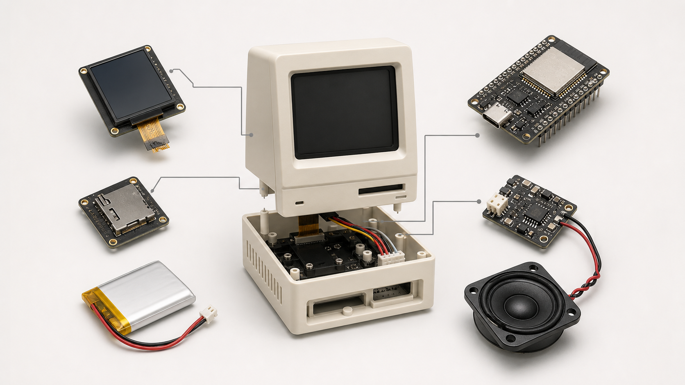
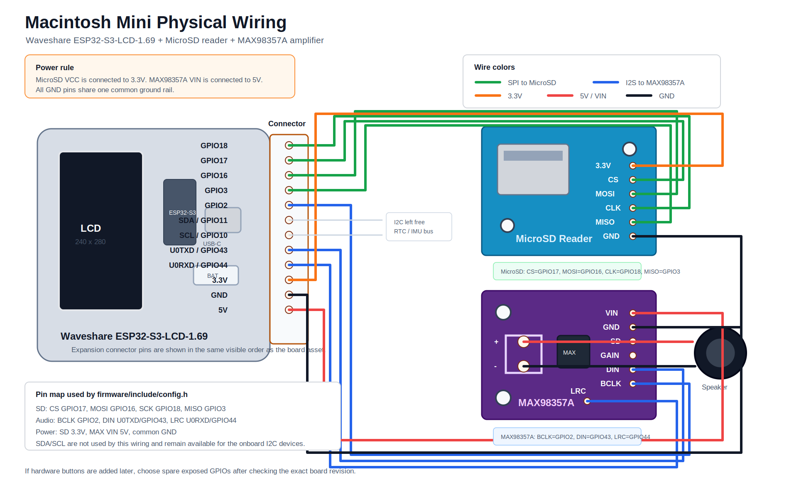
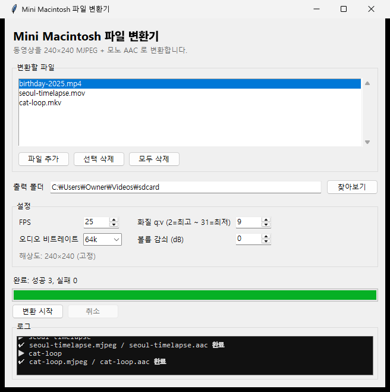

# Macintosh Mini

Waveshare ESP32-S3-LCD-1.69 보드를 기반으로 만든 미니 매킨토시 형태의 SD 카드 비디오 플레이어입니다. 펌웨어는 MicroSD의 MJPEG 비디오와 AAC 오디오를 읽어 내장 ST7789V2 LCD와 외장 MAX98357 I2S 앰프로 재생합니다.



## 현재 구조

최종 사용 코드는 `firmware/`의 PlatformIO 프로젝트로 통합되어 있습니다. Windows용 파일 변환기는 미리 빌드된 실행 파일로 `파일변환기/Window용.zip`(Git LFS)에 배포됩니다.

```text
firmware/
  platformio.ini
  partitions.csv
  include/
    config.h
    imu_qmi8658.h
  src/
    main.cpp
  tools/
    convert_video.py
    validate_sd_media.py
파일변환기/
  Window용.zip          # Windows GUI 변환기 배포본 (미리 빌드된 exe, ffmpeg 내장; Git LFS)
docs/
  assets/
    macintosh-mini-hero.png
    file-converter-windows-gui.png
    physical-wiring-diagram.svg
    esp32s3169.png
    microSDReader.png
    max98357A.png
```

## 하드웨어

기준 보드는 Waveshare `ESP32-S3-LCD-1.69` V2입니다.

- ESP32-S3, 16 MB Flash, 8 MB PSRAM
- 1.69 inch 240x280 ST7789V2 LCD
- QMI8658 IMU
- PCF85063 RTC
- LiPo 충전 회로, 전원 버튼, 부저
- 외장 MicroSD SPI 모듈
- 외장 MAX98357 I2S 앰프



## 핀 구성

| 기능 | 신호 | GPIO |
| --- | --- | --- |
| LCD | SCK | 6 |
| LCD | MOSI/SDA | 7 |
| LCD | CS | 5 |
| LCD | DC | 4 |
| LCD | RST | 8 |
| LCD | BL | 15 |
| MicroSD | CS | 3 |
| MicroSD | MOSI | 16 |
| MicroSD | SCK | 17 |
| MicroSD | MISO | 18 |
| MAX98357 | BCLK | 2 |
| MAX98357 | LRC/WS | 44 |
| MAX98357 | DIN | 43 |
| QMI8658 | SDA | 11 |
| QMI8658 | SCL | 10 |
| V2 power hold | SYS_EN | 41 |
| V2 power input | SYS_OUT | 40 |
| V2 buzzer | BUZZ | 42 |
| V2 battery ADC | BAT_ADC | 1 |

핀과 동작 값은 [firmware/include/config.h](firmware/include/config.h)에 모여 있습니다. 구버전 보드나 배선 변경이 있으면 이 파일만 수정하면 됩니다.

### 제품 조립 배선 참고 (케이스 내장용)

케이스에 넣어 버튼을 못 누르는 완제품 형태로 만들 때 적용하는 배선입니다.

- **배터리 재생 시 소리** — MAX98357 `VIN`을 보드의 5V가 아니라 **3.3V(또는 배터리 B+)** 에 연결하세요. 보드의 5V는 USB(VBUS)에서만 나와, 배터리만으로는 앰프가 무전원이 되어 소리가 안 납니다.
- **SD 삽입 = 전원 ON / 제거 = 전원 OFF** — SD 소켓의 **카드 감지 스위치를 전원 버튼(Key2)에 병렬로** 연결하면(삽입 시 닫히는 타입) 카드를 꽂는 순간 전원이 켜집니다. 제거 시에는 펌웨어가 SPI 무응답을 감지해 `SYS_EN`을 내려 스스로 전원을 끕니다. 리더 `3.3V`는 보드 3.3V에 직접 연결합니다.
- **배터리 잔량** — `BAT_ADC`(GPIO1, 200K/100K 분압 → ×3)로 전압을 읽습니다. 충전(USB-C)은 보드의 ETA6098 충전 IC가 하드웨어로 처리합니다.
- **화면 위치** — 케이스 베젤이 가리는 만큼 [config.h](firmware/include/config.h)의 `VideoTopMargin`/`VideoBottomMargin`으로 영상·UI를 아래로 내리고 화면비를 유지한 채 창 안에 맞춥니다.

> ⚠️ 이 보드는 소프트 전원 래치라, **배터리만 연결한 상태에서 리셋 버튼을 누르면 전원이 꺼집니다**(SYS_EN이 순간적으로 풀림). 다시 켜려면 전원 버튼을 누르세요. 리셋 버튼은 USB 연결 상태에서만 재부팅 용도로 쓰입니다.

## 소프트웨어 특성

- PlatformIO + Arduino framework 기반 ESP32-S3 펌웨어
- `Arduino_GFX`로 ST7789V2 LCD 구동
- `JPEGDEC`로 MJPEG 프레임 디코딩
- `arduino-libhelix` AAC 디코더와 I2S DMA 오디오 출력
- FreeRTOS 태스크로 AAC 디코딩, JPEG 디코딩, LCD 전송 분리
- PSRAM 기반 JPEG/RGB565 버퍼 풀과 큐로 프레임 소유권 관리
- QMI8658 IMU 기울기 기반 볼륨 조절 (기울기가 클수록 빠르게 증감) 및 볼륨에 비례하는 부저 피드백
- QMI8658 IMU 위아래 흔들기로 재생 일시정지/재개 (오디오·비디오 동시 정지, 싱크 유지 재개)
- 일시정지 중에도 볼륨 바(OSD)를 실시간 표시
- 배터리 전압 측정(GPIO1) → 저전압 시 빨간 번개 경고, 충전 중 전체화면 배터리 표시(잔량 20단계, 색상: ≤19% 빨강 / ≤79% 노랑 / 이후 연두)
- SD 카드 삽입 감지 기반 전원 제어(카드 없으면 최소 전원, 삽입 시 켜짐/제거 시 꺼짐 — 하드웨어 배선 필요)
- 케이스 여백에 맞춰 영상·UI를 아래로 이동하고 화면비 유지 스케일링
- SD 카드 전기적 응답과 마운트 실패 단계를 시리얼 로그로 진단
- `Loading` 및 `Transition` 예약 클립 지원

## 조작 방법

물리 버튼 없이 IMU 제스처로 재생을 제어합니다. (버튼 핀을 배선하면 `config.h`에서 `PinButtonPause`/`PinButtonNext`로 병행 사용 가능)

- **볼륨 조절**: 화면 평면에서 기기를 시계 방향으로 기울이면 커지고 반시계 방향으로 기울이면 작아집니다. 데드존을 벗어난 기울기가 클수록 스텝 주기가 짧아져 더 빠르게 증감합니다(살짝 기울이면 천천히·미세하게, 많이 기울이면 빠르게). 조절 단계마다 부저로 틱 피드백을 주며, **틱 소리 크기는 현재 볼륨에 비례**합니다.
- **볼륨 바 표시**: 볼륨을 조절하면 화면 하단에 볼륨 바가 잠시 나타났다 사라집니다. **일시정지 상태에서도** 마지막 프레임 위에 볼륨 바가 실시간으로 표시됩니다.
- **일시정지 / 재개**: 기기를 위아래로 흔들면 재생이 멈춥니다. 위아래(중력 방향) 움직임만 인식하므로 좌우·앞뒤 흔들기는 무시합니다. 이때 오디오와 비디오가 같은 지점에서 동시에 정지하고, 한 번 더 흔들면 그 지점부터 싱크를 유지한 채 다시 재생됩니다. 흔드는 동안에는 흔들림 충격이 볼륨을 건드리지 않도록 볼륨이 고정됩니다.
- **배터리 / 충전 표시**: 배터리가 낮으면 화면 우상단에 빨간 번개 경고가 뜹니다. USB로 **충전 중이면 SD·재생 여부와 무관하게 화면 가운데에 배터리 아이콘(20단계 채움 + 퍼센트)** 이 표시됩니다(≤19% 빨강 / ≤79% 노랑 / 이후 연두). 충전 감지는 전용 신호가 없어 배터리 전압 추세로 판별하는 휴리스틱입니다.
- **SD 삽입 전원**: (배선 시) 카드를 꽂으면 켜지고, 빼면 스스로 꺼집니다. 자세한 배선은 위의 [제품 조립 배선 참고](#제품-조립-배선-참고-케이스-내장용)를 보세요.

조작 관련 값은 모두 [firmware/include/config.h](firmware/include/config.h)에서 조정합니다.

- 볼륨: `VolumeDeadzoneDeg`, `VolumeStep`, `VolumeStepIntervalMs`(최소 주기 `VolumeStepIntervalMinMs`), `VolumeFullSpeedDeg`(최고속 도달 각도)
- 부저 틱: `BuzzerHapticFreq*`, `BuzzerHapticMs`, `BuzzerHapticMinDuty`/`BuzzerHapticMaxDuty`(음량 범위)
- 흔들기: `Shake*` (임계값, 크로싱 횟수, 시간 창, 쿨다운)
- 배터리: `BatteryLowVoltage`(경고 임계), `BatteryFull/EmptyVoltage`(퍼센트 범위), `BatteryChargeFull/Clear/StepVoltage`(충전 감지)
- SD 전원: `SdPowerControlEnable`, `SdAbsentPollMs`
- 화면 위치: `VideoTopMargin`/`VideoBottomMargin`(케이스 여백), `VideoFrameWidth`/`VideoFrameHeight`(소스 해상도)

## SD 카드 파일 규칙

SD 카드 루트에 같은 이름의 `.mjpeg`와 `.aac` 파일을 둡니다.

```text
/Loading.mjpeg
/Loading.aac
/Transition.mjpeg
/Transition.aac
/sample-01.mjpeg
/sample-01.aac
```

`Loading`은 부팅 후 한 번 재생됩니다. `Transition`은 영상 사이에 재생됩니다. 둘 다 선택 사항이며, 해당 `.mjpeg` 파일이 없으면 자동으로 건너뜁니다. 일반 재생 목록은 SD 카드에서 검색한 `*.mjpeg` 파일로 구성되고, 같은 이름의 `.aac` 파일이 있으면 오디오도 함께 재생됩니다.

## 영상 변환

### Windows GUI 변환기 사용 설명서

Windows 사용자는 GUI 변환기로 동영상을 드래그·설정만으로 펌웨어 형식(MJPEG + 모노 AAC)으로 변환할 수 있습니다. 출력 해상도는 조절 가능하며 기본값은 **240×200**입니다. ffmpeg가 함께 번들되어 별도 설치가 필요 없습니다.



#### 1. 설치 및 실행

배포본은 [`파일변환기/Window용.zip`](파일변환기/Window용.zip)(Git LFS)에 있습니다. 압축을 풀고 **`실행.bat` 하나만 더블클릭**하면 됩니다. (또는 `app/converter.exe` 직접 실행)

- **미리 빌드된 실행 파일**(`app/converter.exe`)이 들어 있어 곧바로 실행됩니다. **Python 설치도, 인터넷 연결도 필요 없습니다.** ffmpeg는 실행 파일에 내장되어 있습니다.
- `source/converter.py`는 참고용 소스입니다.

#### 2. 변환 단계

1. **파일 추가** — `파일 추가` 버튼으로 변환할 동영상(mp4·mov·avi·mkv·m4v·webm)을 고릅니다. 여러 개를 한꺼번에 넣어 일괄 변환할 수 있고, 목록에서 선택 후 `선택 삭제`/`모두 삭제`로 정리합니다. **이미 변환된 `.mjpeg` 파일을 넣으면 지정한 해상도로 크기만 다시 조절**합니다(오디오는 건드리지 않음). 출력 폴더를 입력과 같게 두면 원본 파일을 그 자리에서 교체합니다.
2. **출력 폴더 지정** — `.mjpeg`/`.aac`가 저장될 폴더를 `찾아보기`로 선택합니다. (첫 파일을 추가하면 그 파일이 있는 폴더가 자동으로 채워집니다.)
3. **설정 조정** — 아래 표를 참고해 FPS·화질·오디오 옵션을 정합니다. 기본값이 기기에 맞춰져 있어 보통 그대로 두면 됩니다.
4. **변환 시작** — `변환 시작`을 누르면 진행바와 로그로 상태가 표시됩니다. 도중에 `취소`로 중단할 수 있습니다.
5. **완료** — 각 입력 파일마다 `<이름>.mjpeg`와 `<이름>.aac`가 출력 폴더에 생성됩니다.

#### 3. 설정 항목

| 항목 | 기본값 | 설명 |
| --- | --- | --- |
| FPS | 25 | 초당 프레임 수. 펌웨어(`cfg::VideoFps`) 기본값과 맞춰 25 권장. |
| 화질 q:v | 9 | MJPEG 품질(2=최고 ~ 31=최저). 낮출수록 화질↑·용량↑. 8~12 권장. |
| 오디오 비트레이트 | 64k | AAC 비트레이트(24k~128k). 48~64k면 충분. |
| 볼륨 감쇠 (dB) | 0 | 오디오를 지정 dB만큼 낮춤. 원음이 너무 클 때만 사용. |
| 가로 / 세로 (px) | 240 / 200 | 출력 해상도. 화면비와 무관하게 중앙을 채워 크롭(레터박스 없음). 기기 화면에 맞게 조절, 짝수 권장. |

> **해상도를 바꾸면 펌웨어도 맞춰야 합니다.** [firmware/include/config.h](firmware/include/config.h)의 `VideoFrameWidth`/`VideoFrameHeight`를 변환기에서 쓴 값과 동일하게 설정하세요. 펌웨어는 이 소스 프레임을 케이스 여백(`VideoTopMargin`/`VideoBottomMargin`) 안쪽에 **화면비를 유지한 채** 맞춰 그립니다. 기본 240×200은 위·아래 여백 40px 창(240×200)에 1:1로 딱 맞습니다.
>
> 화질을 너무 높이면(q:v를 크게 낮추면) 한 프레임이 펌웨어 버퍼(약 26KB)를 넘어 재생 시 프레임이 드롭될 수 있습니다. 기본값 부근에서는 안전합니다.

#### 4. 결과 파일 사용

생성된 `<이름>.mjpeg`와 `<이름>.aac`를 **SD 카드 루트에 함께 복사**한 뒤 기기에 넣으면 재생 목록에 자동으로 포함됩니다(같은 이름의 두 파일이 한 쌍). 자세한 파일 규칙은 위의 [SD 카드 파일 규칙](#sd-카드-파일-규칙)을 참고하세요.

#### 5. 문제 해결

- **창이 안 열려요** — 압축을 다시 풀어 `app` 폴더(`app/converter.exe`)가 `실행.bat`과 함께 있는지 확인하세요. ffmpeg는 실행 파일에 내장되어 있습니다.
- **재생 시 영상이 끊겨요** — 화질 q:v 값을 조금 높여(예: 10~12) 프레임 용량을 줄여 보세요.

### 명령줄 변환기

PC에 `ffmpeg`가 설치되어 있어야 합니다.

```bash
cd firmware
python tools/convert_video.py input.mp4 --out sdcard --name sample-01 --fps 25
```

기본 해상도는 `--size 240:200`(펌웨어 기본값과 동일)이며 `--size 가로:세로`로 바꿀 수 있습니다. 권장 값:

- 해상도: 240×200 (펌웨어 `VideoFrameWidth`/`VideoFrameHeight`와 일치시킬 것)
- FPS: 25
- 비디오: MJPEG, `q:v 8-12`
- 오디오: AAC ADTS, mono, 44.1 kHz, 48-64 kbps

변환한 파일을 검증하려면 다음 명령을 실행합니다.

```bash
cd firmware
python tools/validate_sd_media.py sdcard --name sample-01 --config include/config.h
```

## 빌드와 업로드

```bash
cd firmware
pio run
pio run -t upload
pio device monitor
```

VS Code에서는 PlatformIO 확장을 설치하고 `firmware/` 폴더를 열면 됩니다. USB-JTAG 디버깅은 `platformio.ini`의 `debug_tool = esp-builtin` 설정을 사용합니다.

## 참고 링크

- Waveshare ESP32-S3-LCD-1.69: https://www.waveshare.com/wiki/ESP32-S3-LCD-1.69
- Arduino_GFX: https://github.com/moononournation/Arduino_GFX
- JPEGDEC: https://github.com/bitbank2/JPEGDEC
- arduino-libhelix: https://github.com/pschatzmann/arduino-libhelix
